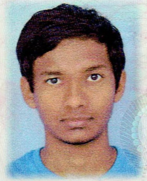
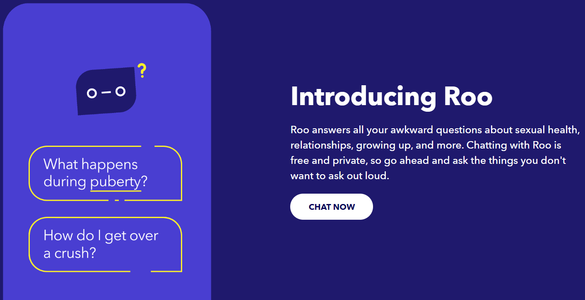
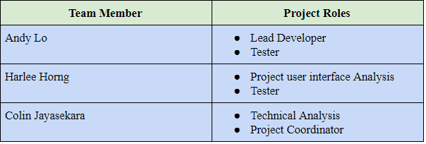
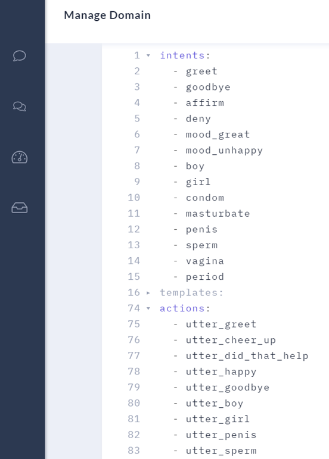
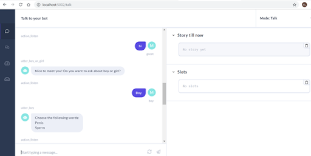
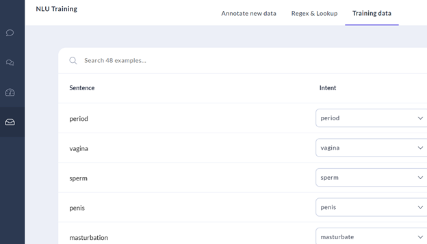
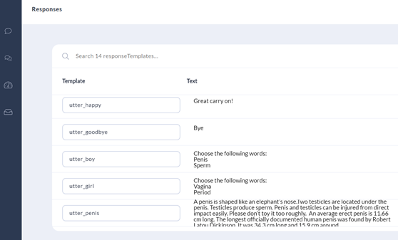

# Team Profile

**Team Name**: 'Team Name'

## Personal Information

## Colin:

**Name**: Colin Madusanka Jayasekara

**Student Number**: s3670061

**Email Address**: s3670061@student.rmit.edu.au

**Date of Birth**: 21/08/1996
My name is Colin Madusanka Jayasekara but my full name is Jayasekara Mudiyanselage Colin Madusanka Jayasekara which happens to be title given by kings to those who are loyal to the throne, I was born on 21st August 1996. My Student ID is S3670061 and my email is S3670061@student.rmit.edu.au. I am a Sri Lankan born in Colombo, Sri Lanka and I was born to a Buddhist family, hence I am classified as a Buddhist. I am a 23-year-old Male with a height of 173cm (or 5’8) and I am currently living in Melbourne, Australia attending The Royal Melbourne Institute of Technology (RMIT) studying for my Bachelors of Engineering in Aerospace Engineering, I am due to complete my course in 2021 and I hope to be working in an aerospace company or start my own in Australia or Sri Lanka, I also speak 2 languages Sinhala and English and I am also open to learning more languages. My favorite hobbies include playing games, watching videos on YouTube and daydreaming about multitudes of possibilities that might/might not occur. I also like to research random things on the internet when it comes to my mind, like how to code in Python or how to make mini Drones/Rockets or watching any other sort of documentary that I feel like intrigues or interests me. Our team name for this project is “Team Name” since we thought it would be ironic and deadpan funny for a team to have such a name.

Individual website: [Colin's website](https://colinjayasekara.github.io/?fbclid=IwAR3ECfmlPpG9mkYEJloz5BvL4W23hQQEVSz7JTlk6spQVdvwqAI-8UvlnKU) 

## Harlee:

**Name**: Harlee Horng

**Student Number**: s3717748

**Email Address**: s3717748@student.rmit.edu.au

**Date of Birth**: 26/12/1999

My name is Harlee Horng, born in Australia in the year of 1999. My nationality is Cambodian as both of my parents are from there. When I was younger, my parents were firm believers of the Buddhism religion, therefore, so was my older sister and me. We would attend events held at the temple on occasions, including the major Chinese New Year festival which took place annually. By the age of 8, I was able to speak the Cambodian language (Khmer) fluently, but the ability to speak it faded away as I grew up and now, I am only able to understand it. Growing up, my family consisted of my mum, dad, sister and me. This changed in the year of 2014, when my dad remarried. A year after the marriage, a little stepsister joined our family who is currently 4 years old and currently attending kindergarten. I had a standard education like most other people, consisting of; kindergarten, primary school, high school and now currently studying at university. I graduated in the year of 2017 with a low ATAR, which required me to complete a year of a diploma course before transferring to a bachelor's degree at RMIT. I acquired my first job at Maccas whilst I was in year 12 and I am still working there right now. As soon as I had enough money to afford a decent computer, I spent all my savings that I had at the time to build my computer. My hobby is playing video games on my PC. One specific game that I enjoy the most is ‘League of Legends’ which I have played consistently and constantly for 6 years.

An interesting fact about me is that I got detention on my first week of primary school because I chased other students around with a stick. Oddly enough, my personality has shifted dramatically from when I was a child. I used to be confident and outgoing, contrasted to how I am now - which is quiet, introverted and antisocial.

Individual website: [Harlee's website](https://hharlee.github.io/ProfileHarlee) 

## Andy:

**Name**: Andy Lo

**Student Number**: s3599772

**Email Address**: s359772@student.rmit.edu.au

**Date of Birth**: 17/08/1997

My name is Andy Lo, was born in August of 1997. My Student ID is S399772 and my email is S3599772@student.rmit.edu.au. My family is Catholic so attending church on Sunday was a childhood memory for me. I came from Hong Kong to Australia to attend high school and then to RMIT. During this year, I will graduate from bachelor and seek for accounting job. My favourite food is noodles. My hobbies include watching YouTube videos and play mobile games. If there is more time on holiday period, I may travel to a suburb near my home and take a refreshing walk. Our group tried to think of a team name related to Asian as we have a connection with that. Even so, “Team Name” is better, I believe without any specific reason. 

Individual website: [Andy's website](https://andy3599772.github.io/) 

## Group Processes:
Our group worked remarkably with access to Facebook messenger to communicate progress on our individually assigned roles as well as a google drive repository set for all members to submit their work and eventually add together into one document. We had a positive attitude throughout the project and accepted all types of inputs and ideas without judgement. Despite one of our group members disappearing out of the blue, the rest of us worked hard on our respective roles and completed our project collaboratively. I believe that we worked well together due to our access to the messenger app as it allowed us to message one another at any time for a quick response. 

## Career Plans:
All our ideal jobs involve; working in a team environment, good communication skills and knowledge of IT skills relevant to each job. We had differing jobs from one another. Harlee aims towards an ‘IT Support help desk job’ in the IT field, whereas Andy wants to become an ‘Accounts Officer’ which is in the accounting field and Colin wishes to become a ‘Vice-President of Strategic Capture’ in the engineering field. 

Each of our jobs are in different fields and require different amounts of experience in order to achieve them. While Harlee and Andy aim for a job with minimal previous experience (less than 3 years) to attain them, Colin wishes to end up with a job as vice president which requires passion to gain approximately 15 years of previous experience in the field. A position such as vice-president of a company would most likely be a job high in demand as it is high on the job hierarchy with many benefits; such as job security, good pay, etc. An ‘Accounts Officer’ job is another job which ranks highly in terms of demand.
With Harlee’s ideal job being the only job based in the IT field he requires many skills sets of IT-specific skills. These include many of the top listed skills in high demand such as; SQL, Java, JavaScript, Microsoft Windows, etc. Andy’s job is based in the accounting field; however, he would also require IT-specific skills such as how to operate basic computer programs. Microsoft Windows, Project management and Building relationships is high on the list of skill demand. As an engineer, Colin would need require skills in graphic design, which is ranked lower on the list compared to the other skills required for the other two jobs. In general, communication skills are required for all our ideal jobs as communication is important in teams of sought and demanded. Other general skills we would all need is problem solving, teamwork and planning.

# Tools

Group Website: [Group](https://teamnameit.github.io/TeamName/) 

Github Respository: [Repository](https://github.com/teamnameit/TeamName) 

Based on our success with assignment 2, using Google Drive as our repository, we decided to use it once again for our third assignment. We used GitHub to store pictures we needed to implement onto our website, however we used google drive in conjunction with google docs files in order to collaboratively construct our group project. We set up an ‘IT project’ folder which was shared to all members, as well as designating roles to everyone to ensure everyone knew what to do. We decided that google docs was the best option as it was a familiar repository that all group members were familiar with and knew how to operate. Using google docs made it easier for others to view and amend anything that needs changing. Also, we had a group chat on Facebook messenger which we used to keep everyone on track and allowed for any communication needed between members regarding the project. These tools assisted in setting goals and a timeline to give us a clear vision of where we were headed in terms of project progress. We suggested many kinds of ideas during our discussions but fortunately we were still able to concentrate without disruptions or conflict. The settlement for the idea requires patience and research in our personal time. The fact that we were able to work smoothly throughout the course of the project shows how level of commitment and teamwork.

# Project Description

## Overview
## Topic:
Our Groups plan is to create a Chatterbot for Sex Education for personal use as well as in countries that lack or have no
currently available education in regards to sex education, This is mostly apparent in the African and Asian regions due to the Taboo around such topics being discussed in public as well as with each other, we hope to break down these ideals by helping the curious youth of this Planet to gain access to reliable information on Sex Education which can help raise awareness on the consequences of having un-safe sexual contact and how to prepare themselves in the case of it ever happening.

We are hoping to integrate the chatterbot to official UN and UN-Backed websites which would be accessible by anyone on the planet which would widen the number of people that would be able to gain access to reliable information and not be misled by political forces that are too close-minded to see the benefits of Sex Education. Also we plan to distribute our chatterbot to sex education programs in schools all around the world. This will give young students the support and knowledge they may need growing up.

## Motivation:
Every member in our group come from Asia, as much as we adore our respective countries and planet, we also see room for improvements in currently standing sectors of our country, one of which were the lack of education in Sexual Health and related educations in our native countries education syllabus. We saw the positive effects on integrating a well founded Sex education into the mainstream education syllabus which helped reduce the  number of teenage pregnancies in those countries that had it, we believe our idea is a legitimate method of providing Sex Ed access to those who require or want it without having to endure stiff and close-minded political backlash from certain conservative groups in those countries. we would effectively be avoiding such obstacles since this would not have to be integrated into the mainstream syllabus of countries where this would cause issues but can be advertised as a possible location for help and advice for Se Education for those who want it.

These fit well with current IT trends as more and more countries become IT oriented where such governments are funding to add IT services to all existing government offices and processes where Education is also included in, With the attempt to integrate IT with Education to enhance students learning capabilities, we will not need to fund setting up the foundation for our Project ideas since most countries have already started or have completed in setting up the necessary IT infrastructure in education.

Future employers would be able to recognise that we are capable of coming up with relatable as well as useful ideas that would solve current-day issues in our planet, they would recognise that we have understood a gap in the market and that we have come up with a suitable and cost-effective product that would redue the global expenditure currently spent on pursuing Sex Education. It would also show employers how bold and open-minded our group is, which is an advantage since most of the greatest ideas in history came from people and groups who were bold and open-minded, which would help us personally in our respective fields after we graduate.

## Landscape:
Similar products currently available are a chatbot called ‘Roo’ by R.age (Figure 1) which is available on ‘Planned Parenthood’ Website as well as on predator.my, This chatbot also talks about Sex Education to kids, however this chatbot is kids-friendly and as a result, the information it may provide maybe toned down and less descriptive, which is opposite to what we envision for our Chatbot, We see that not being descriptive or informative enough makes the situation more confusing even if the intentions are good, the best way to make sure Sex Education is effective is by breaking down the censorship barrier so that realistic and all the uselful information about our bodies is taught to kids without information being filtered, kids will always find information on Sex regardless of the existence of chatbots or other related educational services, hence we feel that it would be better for us to take lead on this by providing transparent, useful and visually backed information would better prepare teenagers for the realities of Sexual Health and would increase awareness and preparedness for such encounters which can reduce the number of mishaps that curretly occur with Teenagers and Adults alike.

Figure 1: Roo ChatterBot

The difference between ‘Roo’ and our chatbot would be that the information being given would have been verified by the UN as well as other related and UN-Approved NGOs whereas ‘Roo’ is an NGO verified Chatbot with no official verification by UN. Other differences include more Detail, information and visually oriented instead of being “Kids-Friendly” like ‘Roo’, it is in our best interests that we become more open to discussion without unnecessary filters which is counter-intuitve to the goal of such projects, we are trying to open up to each other about Sex Education, not teach half of whats relevent and prepare teenagers and Adults to the outside world.

## Detailed Description
## Aims:

‘To create a ChatterBot that will provide unfiltered and reliable information. To educate and enhance The public on sexual health on a global scale.’
 
Many people are not exposed to sex education at a high rate across the planet, therefore it is imperative to have services like our Chatterbot to accommodate discussion and gain valuable knowledge of our own body in our own time and with the privacy we may require when learning such topics.

The most important aims of the project:
Provide unfiltered and reliable information: Education materials and sources should be legal and identified globally. They are websites such as [Unfpa](https://www.unfpa.org), [UN WOMEN](https://www.unwomen.org),  [Victoria State Government websites](https://www.education.vic.gov.au) and so on.
Educate and enhance the public on sexual health on a global scale: Let more people become exposed to sex knowledge. In order to do that, we provide our service to schools over the world through internet. 
Advance the chatbot in the future to become more attractive, creative and convenient. Add more support, images, video, cartoon and emoji's. Develop a mobile phone website version or application. Translate into multiple languages. 

## Plans and Progress:
At the start of the project, we studied what a chatterbot is, its purpose, applied range and social influence. Those were completed during the IT World assignment. Then we researched the required tools, program and experience to develop the project, and learned about GitHub, website creation and html. GitHub, W3Schools and Rasa provided the related IT knowledge. Education websites and Wikipedia were the source of the vocabulary of our chatbot topic.

In order to create a chatbot, machine learning tool is usually needed because natural language processing technology understands and classifies the message’s intention. The tool our group chose was Rasa. We encountered related issue during installation as the laptop didn’t have Microsoft Visual Studio, which should be a pre-requirement for Rasa installation.

## Roles:

Our Group Project idea came from Andy Lo whose idea was to create a ChatterBot, due to this, he was placed as Lead Developer since it was his vision we were trying to make a reality. He would be in charge of making a soft development of the ChatterBot that would be able to converse with our group Testers.

Our user interface analysis was given to Harlee since he was keen on the aesthetics of the interface of our ChatterBot since we want it to be as intuitive and user-friendly as possible, He is also our 2nd Tester after the Lead Developer.

Our Technical specification and Project Coordination was given to Colin since he wanted to research the information of what our ChatterBot would be able to provide and also the functions it would be capable of. He was also responsible for Coordination as he has prior experience in doing so. 

Even though we have defined roles for our Group members, we have had a care-free attitude when it comes to giving inputs to each other's work, we functioned better when we were able to cross check and question others work, which made us confident in our project when certain questions regarding certain functions were questioned and all doubts related to it were discussed, where by the end of the discussion we would be aware of the aim of that individual and we would hence get a better idea on what they planned to achieve with their intentions. 

## Scope and Limits:
The Scope of the project involves being able to show a video of the ChatterBot in conversation with one of our Testers, Due to the lack of time and absolutely no experience in coding in any form whatsoever, we will not be able to provide a fully functional ChatterBot as envisioned but rather a demonstration on its current limited capability as well as more functions that we hope to include in the future as we gain the required knowledge to continue this project.

Our ChatterBot is currently in its early stages of programming (Figure 2), where we are testing to see the basic functionality of our intended ChatterBot where we are trying basic welcome messages as well as topic allocation based on Sex of individual to better help people get information that are relevent for their sex.

Figure 2: Domain of ChatterBot code

As of now, we have had success in making a simple conversation between the Testers and the ChatterBot (Figure 3) where we typed and asked basic questions to see if it would respond to it with the coded instructions, which it did, following this we plan to add more intermediate functions and abilities which will allow the ChatterBot to converse about much more complex topics with pictures and have lengthy conversations. With more and more usage, the bot will be able to converse more fluidly with users. Other issues also include integration of this ChatterBot with existing websites like the UN official websites as well as other 3rd party NGO websites which focuses on worldwide sex education.

Figure 3: ChatterBot chat Testing

We would like to continue with our currently acheived progess and continue to build the ChatterBot to a point where it is able to self correct and update itself as the years go by which allows it to stand out of the competition where it will be able to incorporate (with the help of humans) new findings on information related to sex education that have been peer-reviewed and update these new data inputs to its existing information stockpile and output them with existing information with minimal faults. 

## Tools and Technologies:
Chatterbots are created based on the machine learning tool, Rasa (or Rasa X). A machine learning tool is usually needed because natural language processing technology understands and classifies the message’s intention.  AI is then able to give a more appropriate response. Pre-requirement for Rasa installation is to have Python version 3.7 and Microsoft Visual Studio 2019. Rasa runs the chatbot in local server. An application, Ngrok used to obtain the HTTPS address for sharing externally. All our members have no experience on those techniques except Colin who codes Python as a hobby. Lots of reading is required before starting the project.

## Testing:
We can run the chatterbot through the internet or on command prompt. When a new Rasa project was created, we made sure related files (e.g. story, domain) existed. If the AI gives a wrong or empty answer, then it must have some errors in the files which causes difficulty in classifying the intent and response.

When a new Rasa project was created, Andy modified the chat story, intent and response. Rasa runs the project at local server. Andy used an application called ‘Ngrok’ to convert the localhost address to HTTP and then shared it with the group.

Figure 4: Word training of our ChatterBot.

Currently our chatterbot can provide information based on the keywords from the user. If this project continues over until next semester, we may advance the chatterbot by installing a voice configuring function to make the conversation more natural.

Figure 5: Response data inputs.

## Timeframe:

## Risks:
It is planned that the use of our project will be incorporated in schools around the world as a guide for young students in sex education courses to educate them about important sex topics.  A risk associated with a program is that it requires the participant to be proactive. They may not take the opportunity to learn about sex education due to many factors. Some of these factors could include being; shy around the topic of sex education, embarrassed to seek information, unaware of the importance of sex education and scared to seek help.

Despite our efforts to make the sex education chatterbot as discreet as possible, students could still be reserved when it comes to seeking sex education information. In a high school environment, there is a vast amount of pressure placed on every student to fit in. Most students may not see it as cool or socially acceptable to voluntarily seek help in sex education. As a result, it affects our program’s successfulness in educating sex education to young students because the program’s effectiveness is measured by the rate of our program’s participants.

## Group Processes and Communication:
As we have learnt from our previous assignment, our group works very well together with the use of the Facebook Messenger app which connects all our members. This app allows our team to communicate outside of class time and offers an efficient way to easily and conveniently present data, descriptions and other elements with simplicity and ease. We will therefore continue to use this in the future throughout this assignment in order to stay on track with our work and to complete our assignment on time. At the beginning of the third assignment’s working period, we cooperatively divided up the work equally into three parts for our three group members. This step was initiated during a tutorial as it was easier to perform this in person as opposed to splitting up the workload over the group chat. Assigning the assignment tasks in person allowed us to ensure that everyone knew their responsibilities and also gave us the opportunity to speak up if we were unable to do a particular part or had other essential commitments. 

We can focus on our assigned roles for the different sections of the assignment, with the assistance of other group members, if necessary, through the messenger app. Alternatively, if there is a situation requiring a meeting involving face-to-face contact outside of class time, this can be coordinated through the group chat on Facebook.

# Skills and Jobs:
The following are the four position types with a description of their roles: 
1.     Leader: A leader allocates each member’s role, divides their job amount and set work schedule. It’s important to have an understanding of the project direction to ensure everyone in on track with their work and allows us to work towards a set work deadline. With a work deadline in place, the group is able to have a high chance of completing the project by the due date. 

2.     Innovative thinking: The role is to continue coming up with new ideas for the chatterbot with the aim of adjusting and or improving the chatterbot. This will enhance the experience of our chatterbot for users. These ideas can be developed while others are busy with their work.

3.     Searching and sorting information: This person’s role is to search for information via external resources for data needed for the project idea development and to discover a reliable source for solving unknown issues. This position can be done by two people because having more people digging for information is more effective and efficient.

4.     IT technology: Ideally every member should share the similar quality of IT knowledge. Only one or two people have the main control of the IT tools to avoid information asymmetry problem caused by four persons.  

## Feedback:

# Group Reflection:

**What went well**
The group members did their allocated sections well and within the given time, The report formation and other related tasks such as interviews were successfully completed thanks to the group members, we were able to push through even with only 4 active members without too much of a hassle. The teamwork of this group was excellent, where each member took the initiative in getting the due tasks done even with other course assignments and projects due at the same time.

**What could be improved**
If all group members were in constant contact that would reduce the inconveniences faced by the whole team since one absent member will mean more work being allocated to everyone else which is unfair and with the high workloads already placed I believe it is imperative that each member carry their own weight, including myself.

**At least one thing that was surprising**
The level of expertise required to make any of our project ideas become a reality, the factors we have to consider as well as figuring out how to start in making this project idea. The software and the complexity of the idea determined if the project was actually achievable within the given timespan.

**At least one thing that you have learned about groups**
The level of responsibility a team leader must have is immense, there's alot of factors to consider as well as obstacles faced during the course of this project, and finding answers when you are placed on the spot as a team leader is anxiety-inducing as well as requiring a high level of tolerance and patience. All of which will be tested throughout the course of this project. Teamwork is also paramount to the successful completion of any project and without teamwork, the overall morale and efficiency of the group lowers which affects team performance.

