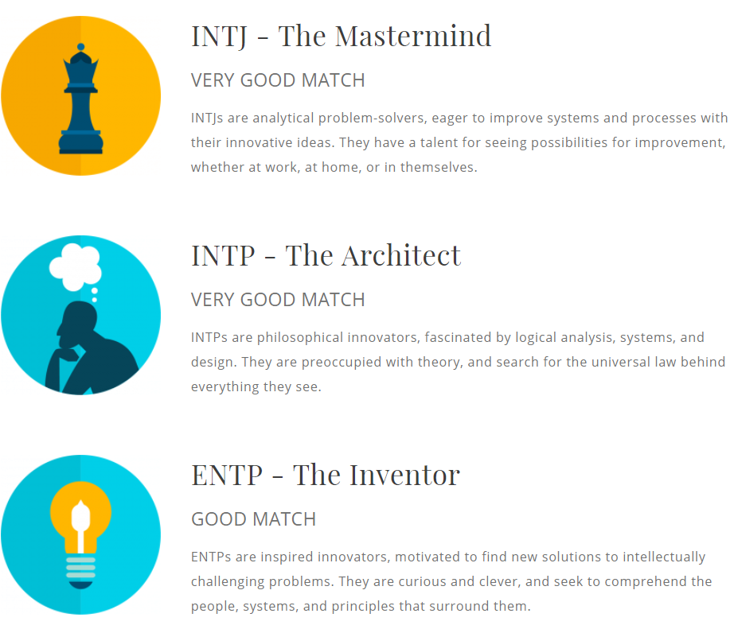
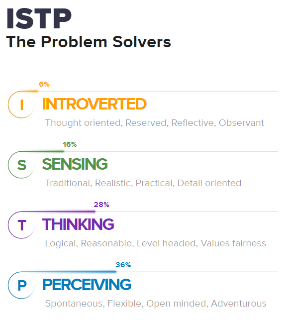
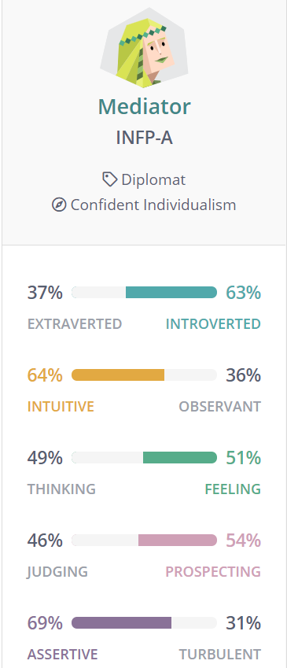
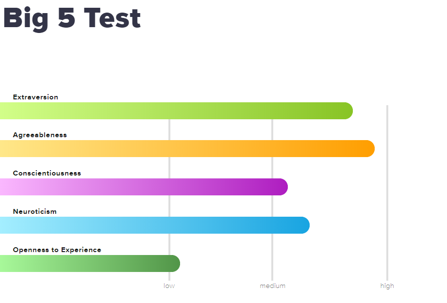
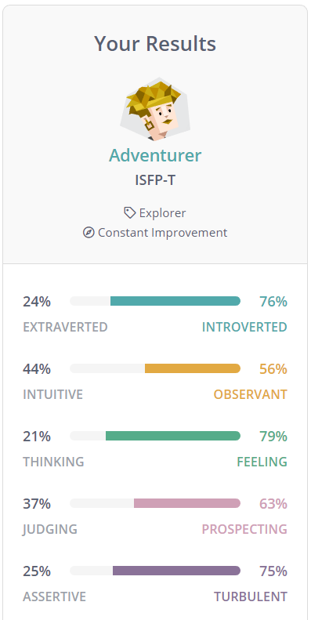
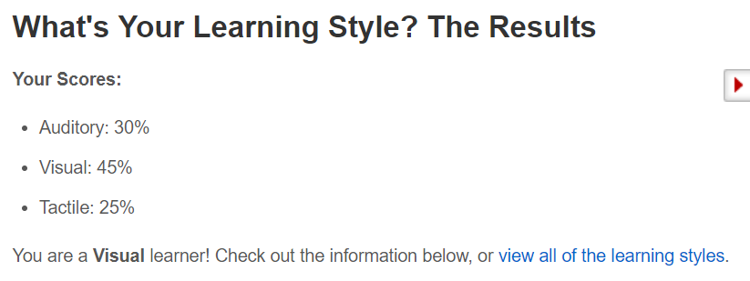
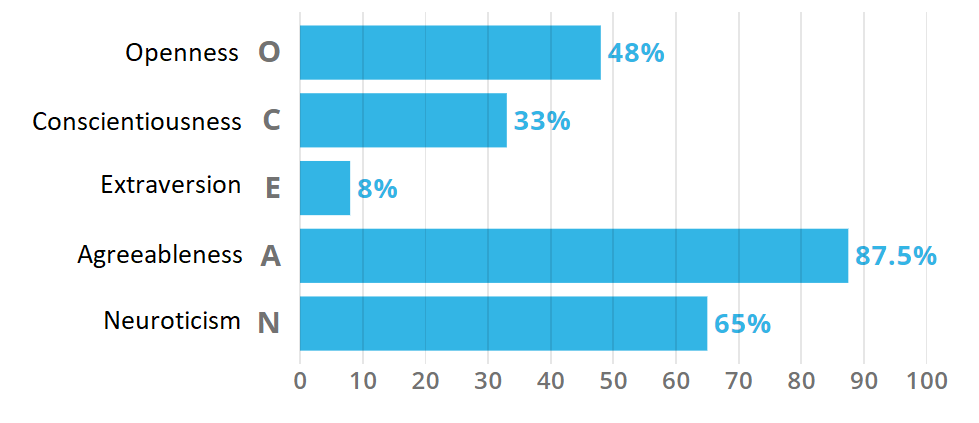
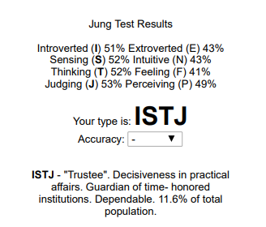
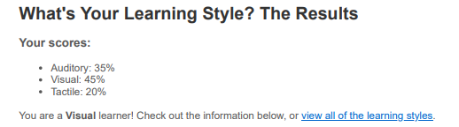
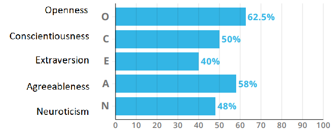

<body style="background-color:beige;">
 
 =======

# Team Profile

**Team Name**: 'Team Name'

## Personal Information

## Colin

**Name**: Colin Madusanka Jayasekara

**Student Number**: s3670061

**Email Address**: s3670061@student.rmit.edu.au

**Date of Birth**: 21/08/1996
My name is Colin Madusanka Jayasekara but my full name is Jayasekara Mudiyanselage Colin Madusanka Jayasekara which happens to be title given by kings to those who are loyal to the throne, I was born on 21st August 1996. My Student ID is S3670061 and my email is S3670061@student.rmit.edu.au. I am a Sri Lankan born in Colombo, Sri Lanka and I was born to a Buddhist family, hence I am classified as a Buddhist. I am a 23-year-old Male with a height of 173cm (or 5’8) and I am currently living in Melbourne, Australia attending The Royal Melbourne Institute of Technology (RMIT) studying for my Bachelors of Engineering in Aerospace Engineering, I am due to complete my course in 2021 and I hope to be working in an aerospace company or start my own in Australia or Sri Lanka, I also speak 2 languages Sinhala and English and I am also open to learning more languages. My favorite hobbies include playing games, watching videos on YouTube and daydreaming about multitudes of possibilities that might/might not occur. I also like to research random things on the internet when it comes to my mind, like how to code in Python or how to make mini Drones/Rockets or watching any other sort of documentary that I feel like intrigues or interests me. Our team name for this project is “Team Name” since we thought it would be ironic and deadpan funny for a team to have such a name.

Individual website: [Colin's website](https://colinjayasekara.github.io/?fbclid=IwAR3ECfmlPpG9mkYEJloz5BvL4W23hQQEVSz7JTlk6spQVdvwqAI-8UvlnKU) 

## Harlee

**Name**: Harlee Horng

**Student Number**: s3717748

**Email Address**: s3717748@student.rmit.edu.au

**Date of Birth**: 26/12/1999

My name is Harlee Horng, born in Australia in the year of 1999. My nationality is Cambodian as both of my parents are from there. When I was younger, my parents were firm believers of the Buddhism religion, therefore, so was my older sister and me. We would attend events held at the temple on occasions, including the major Chinese New Year festival which took place annually. By the age of 8, I was able to speak the Cambodian language (Khmer) fluently, but the ability to speak it faded away as I grew up and now, I am only able to understand it. Growing up, my family consisted of my mum, dad, sister and me. This changed in the year of 2014, when my dad remarried. A year after the marriage, a little stepsister joined our family who is currently 4 years old and currently attending kindergarten. I had a standard education like most other people, consisting of; kindergarten, primary school, high school and now currently studying at university. I graduated in the year of 2017 with a low ATAR, which required me to complete a year of a diploma course before transferring to a bachelor's degree at RMIT. I acquired my first job at Maccas whilst I was in year 12 and I am still working there right now. As soon as I had enough money to afford a decent computer, I spent all my savings that I had at the time to build my computer. My hobby is playing video games on my PC. One specific game that I enjoy the most is ‘League of Legends’ which I have played consistently and constantly for 6 years.

An interesting fact about me is that I got detention on my first week of primary school because I chased other students around with a stick. Oddly enough, my personality has shifted dramatically from when I was a child. I used to be confident and outgoing, contrasted to how I am now - which is quiet, introverted and antisocial.

Individual website: [Harlee's website](https://hharlee.github.io/ProfileHarlee) 

## Andy

**Name**: Andy Lo

**Student Number**: s3599772

**Email Address**: s359772@student.rmit.edu.au

**Date of Birth**: 17/08/1997

My name is Andy Lo, was born in August of 1997. My Student ID is S399772 and my email is S3599772@student.rmit.edu.au. My family is Catholic so attending church on Sunday was a childhood memory for me. I came from Hong Kong to Australia to attend high school and then to RMIT. During this year, I will graduate from bachelor and seek for accounting job. My favourite food is noodles. My hobbies include watching YouTube videos and play mobile games. If there is more time on holiday period, I may travel to a suburb near my home and take a refreshing walk. Our group tried to think of a team name related to Asian as we have a connection with that. Even so, “Team Name” is better, I believe without any specific reason. 

Individual website: [Andy's website](https://andy3599772.github.io/) 

## Team Profile

**Colin's test results:**

These test results show that I am capable of achieving my goals, although there are some things that I must fix in order to get to my desired job position faster, where I would need to immerse myself in team discussions and be more vocal and outgoing when it comes to socializing as it will lead to connecting with important people in my area of work which can boost my probabilities of moving up the hierarchical chain.

These test results indicate that I would work well in teams and that I would be fit to be a team leader if and when needed to be, therefore I believe that my personal skills might be valuable as I would be able to coordinate tasks and overall goal accomplishments as I apparently have a good ability to understand individuals which means that I would be able to divide tasks up between people according to what I believe would be their individual strengths thus making a more effective and efficient team.

I'm not worried too much about what team I end up with since I won’t be able to choose which team members I can work with when I get a job and hence I would be required to work with whoever is there. Due to this I would try to take tasks that would fit my personal skills like creativity better, I will try to do parts of the project that would be a lot easier for me to accomplish so as to not inconvenience the entire team thus reducing efficiency.

**Harlee's test results:**

The results of these tests show that I am introverted and prefer to work independently. They convey that I take a more observant approach to group work and participate with low levels of openness. I believe that because I am more inclined to agree with people, it would cause less disruption and arguments in a team. As a result, I feel that I would be a good group member in terms of completing my part of the project. Regarding forming a team, I think it would be best to group up with people with the same or similar attributes as I have.

**Andy's test results:**

The test results show my way of living in general and have my attitude at work analyzed. Big Five Personality test judges that preference for me not seeking much attention from others, and corporate instead of compete is preferred, as the grade for extraversion is 40% and agreeableness is 58%. The results may not be 100% correct and won’t affect my preference of choosing a group. Nonetheless, it provided a clear picture of my role in a team.

## Ideal Jobs
All our jobs involve; working in a team environment, good communication skills and knowledge of IT skills relevant to each job. We had differing jobs from one another. Harlee aims towards an ‘IT Support help desk job’ in the IT field, whereas Andy wants to become an ‘Accounts Officer’ which is in the accounting field and Colin wishes to become a ‘Vice-President of Strategic Capture’ in the engineering field. Each of our jobs are in different fields and require different amounts of experience in order to achieve them. While Harlee and Andy aim for a job with minimal previous experience (less than 3 years) to attain them, Colin wishes to end up with a job as vice president which requires approximately 15 years of previous experience in the field.

# Industry Data

**1. What are the Job Titles for your group’s ideal jobs? How do each of these rank in terms of demand from employers?**
Harlee’s ideal job title is an ‘IT support’ desk job, while Colin’s ideal job title is ‘Vice-President of Strategic Capture’ and Andy’s ideal job is an Accounts Officer’. An ‘IT support’ job is seemingly a job low in demand as it is ranked either very low or unranked. A position such as vice-president of a company would most likely be a job high in demand as it is high on the job hierarchy with many benefits; such as job security, good pay, etc. An ‘Accounts Officer’ job is another job which ranks highly in terms of demand.

**2. From your group’s ideal jobs, you can identify a set of skills required for these jobs (we will refer to this as your group’s required skill set). These can be divided into general skills (communication, problem solving, writing etc) and IT-specific skills (Javascript, SQL, etc).**

**a. How do the IT-specific skills in your required skill set rank in terms of demand from employers?**

With Harlee’s ideal job being the only job based in the IT field he requires many skills sets of IT-specific skills. These include many of the top listed skills in high demand such as; SQL, Java, JavaScript, Microsoft Windows, etc. Andy’s job is based in the accounting field; however, he would also require IT-specific skills such as how to operate basic computer programs. Microsoft Windows, Project management and Building relationships is high on the list of skill demand. As an engineer, Colin would need require skills in graphic design, which is ranked lower on the list compared to the other skills required for the other two jobs.

**b. How do the general skills in your required skill set rank in terms of demand from employers?**

Communication skills are the most sought and demanded skill as it is shown to be the highest demanded skill by far. I believe this skill would be required for all our ideal jobs as communication is important in teams. Other general skills we would all need is problem solving, teamwork/collaborating and planning, which are all highly rated in the list.

**c. What are the three highest ranked IT-specific skills which are not in your required skill set?**

The three highest ranked IT-specific skills which are not a required skill set for our ideal jobs would include; SAP, business management and git.

**d. What are the three highest ranked general skills which are not in your required skill set?**

The three highest ranked general skills which are not in our required skill set would include; writing, creativity and mentoring.

**3. Having looked at the Burning Glass data, has your opinion of your ideal job changed? Why or why not?**

Having looked at statistics of my ideal job in comparison to other jobs, my opinion on my chosen ideal job has not changed. This is because it is my passion and I believe that it would be better to have a job which you are passionate about instead of a job which you don’t like for the purpose of its demand by employees.

# IT Work

**Approach: interview an IT professional**
We interviewed a contract System Analyst, Benny Lo, working in the Government of Hong Kong Special Administrative Region.

**1. What kind of work is done by the IT professional?**
The IT professsional carries out IT contracts, administration, support and update of terms of conditions of IT tender procurements.
 
**2. What kinds of people does the IT professional interact with? Are they other IT professionals? Clients? Investors? The general public?**
The IT professional needs to interact with users from various operational departments of the Government and the professional legal department. He also needs to collaborate with vendor companies.Some of the users are daily functional users while others are application developer, system maintenance/administration staff.
 
**3. Where does the IT professional spend most of their time?**
The daily job includes: 

-input of crucial information of government IT contracts into the contract information system and maintain the data integrity

-support the operations of contract information system

-reply to the enquiries regarding the IT projects contractual issues

-compile various reports from the data in the contract information system for department senior management team

-help to compile the standard terms and conditions for tender procurement with the legal advice from the government legal department

-reply the enquiries regarding the IT tenders procurement issues

-help to conduct evaluation of IT tenders that provide services to the government

**4. What aspect of their position is most challenging?**
The most difficult and challenging parts of the job is giving advice to enquires from various departments regarding the use of the prevailing terms and conditions in order to fulfill their specific IT contract or IT tender requirements. Also, since the terms and conditions are generally laid down to suit most of the IT contracts and IT tenders procurement, it has to be continuously maintained to cater for the changing IT industry and technology.

# IT Technologies

## Autonomous vehicles

**What does it do? (600 words) What is the state of the art of this new technology? What can be done now? What is likely to be able to do be done soon (say in the next 3 years)? What technological or other developments make this possible? **

Autonomous vehicles are self controlled modes of transport (road vehicles, aircrafts, ships, spacecrafts) that would take the job of controlling and directing the respective transport  mode off the hand of a real human being and accomplish the same task on it’s own, This means that the route it will take from it’s starting point to destination will be made onboard on its own internal computer as well as the actual driving of it while also accounting for the real-time traffic, weather and other factors. This technology is capable of increasing the road, flight, shipping and space travel safety if done correctly and is also capable of making the entirety of the transport movements more efficient and less time consuming than our current condition. 

The majority of the currently tested/testing models of Autonomous vehicles depend heavily on a mix of GPS and an array of Sensors and Cameras installed throughout and around the interior and exterior of the vehicle which will monitor the passengers/payloads as well as the environmental conditions to decide which route to use and what speeds to travel with. Current examples are the Mars rover which requires little input from humans and takes more inputs from its surroundings, more examples include Drones that travel to its preset destination on its own, Google self driving cars which have travelled 140000 miles or 225,308.16km with minimal human interaction, it uses sensors to scan roads for people crossings and road signs and traffic lights to determine if it needs to go or slow down. And more notable eg is Tesla which is selling commercial vehicles capable of self driving to a limited degree on highways and roads in limited countries where it learns and gets better with more use.   

Autonomous functions are beyond its early stages but it is yet to draw the confidence of the majority entirely since no machine can account for other human decisions who think instictly based on faced situation and not based on coded logic. However with the increase in attention to Autonomous transport systems I believe that these systems will get much better with adapting to human conditions and become better at accounting for its own actions as well as other humans on road, air, sea and in space where the net 3 years will see much better variations of autonomous transport that might hopefully be adopted citywide to nationwide after it has concluded on the legalities of autonomous vehicles
To make these systems better, more support will be required from standing governments and its authorities to allow more testing of such systems in the actual area with some limitations that will allow the testers to identify and correct errors that a vehicle would likely face in order to get these systems to learn better and become more reliable since they all depend on data and lack of data means less accuracy and a lower chance of overall success as well helping to improve public perception of autonomous transports instead of criticising it . 

**What is the likely impact? (300 words) What is the potential impact of this development? What is likely to change? Which people will be most affected and how? Will this create, replace or make redundant any current jobs or technologies?**

Likely impacts would mean more reliability in autonomous systems and much better upgrades in autonomous systems that would allow widespread use with high adoption rates as well as a more efficient transport system which would save billions of taxpayer money per year and a higher growth rate of businesses since they wouldn't have to account for losses incurred by humans and with widespread use, autonomous systems will become cheaper to use and hence more affordable for business that helps them grow thus also aiding in economic growth of respective countries that helps them invest these profits into more development programs for the country. But it also can take away jobs from drivers,Pilots, Ship captains etc by rendering their presence useless which can increase unemployment rates, however these can be avoided if the governments initiate programs that help these newly unemployed drivers be absorbed into the Autonomous industry where they could become part of the assembly line for these systems as well as testers, that would offset the drop in unemployment rates.These are however in the hands of the legislators and politicians involved in this area. 
Pursuing these areas have the potential to open up more room for new areas of research that have yet to be discovered which means training individuals to research and develop solutions to these areas which means more job opportunities, but as automation continues, more emphasis must be put on whether placing a limit on autonomous use be considered an option in order to revive or give time for actual human workforce to catch up with the economic demands and try to reduce the effect of unemployment.

**How will this affect you? (300 words) In your daily life, how will this affect you? What will be different for you? How might this affect members of your family or your friends?**

These systems might make my personal life easier since as an Aerospace Engineer the need for planners and designers will always be present though the ability for autonomous systems to replace me still looms above me and millions of others like me, I still believe that certain logics cannot be replicated by machines, especially aspects of behavior and way of thinking that it truly unique to humans where we are able to decide and carry out an action based on a gut feeling that works or using what is around us at hand to create something or accomplish a goal compared to Autonomous systems that require an abundance of data which it needs to sift through before making a decision. 
My transport life would be much faster and more efficient than current methods and based on what professions my family members decide to pursue it can either aid them in their respective fields or deprive them of their career due to Autonomous systems, How it affects you depends on where you work and how much of it you let it get to your head, If you continue working in a way that make you stand out, I believe will make you much more of an asset than a liability to your respective place of work.

## Cybersecurity

**What does it do? (600 words) What is the state of the art of this new technology? What can be done now? What is likely to be able to do be done soon (say in the next 3 years)? What technological or other developments make this possible?**

Cybersecurity involves protecting and recovering networks, devices and programs from any type of cyberattack. A cyberattack in terms of computers and computer networks is any attempt to expose, alter, disable, destroy, steal or gain unauthorized access or usage of an asset. Cyberattacks can range from low impact attacks such as installing spyware on a personal computer, which collects information about surfing habits over the internet connection, then downloads and displays a bunch of popup advertisements. As a result of these barrage of popup advertisements, the computer may be slowed down. While this type of cyberattack may not be all that threatening, a high impact cyberattack may include an attempt of destroying the infrastructure of entire nations. An example of a recent cyberattack is when cyber attackers stole data from 29 million Facebook accounts. To defend against cyberattacks, cybersecurity is set in place to prevent and protect against cyberattacks. Cybersecurity systems are composed of network security systems and computer security systems. Both systems should at least include a firewall, antivirus software, and an intrusion detection system. An intrusion detection system helps to discover, determine and identify unauthorized use, duplication, alteration and destruction of information systems. These systems work to prevent cyberattacks. 
Cybersecurity is becoming more important than ever as we advance into new ages. Nowadays, the preferred method of payment is card payment as opposed to cash. Cash is easily lost or stolen and while stolen cards can be cancelled, preventing theft of money. People are also able to use their phones to manage money and pay. As well as cards being the main method of paying for many, most people are also making the switch to phones for public transport needs. With the introduction of public transport tickets on phones, our society is encouraged to ditch the card and use their phones instead. Along with these other two technological advancements, there has also been a change with how people hire rides to get places. In the past, the only option was the ring the taxi company to book a taxi. However, Uber was introduced in 2009 which was a game changer to the industry, causing major riots from taxi workers. With Uber, customers can instantly book a ride with a few pushes of a button on their smartphones. These three examples show the technological advancements constantly occurring in the world. This is no different from cybersecurity because as cybersecurity technologically advanced, so do cyberattacks.
In the upcoming years, cyberattack technology will develop for both good and bad reasons; to monitor cyberattack activity and help prevent them and to further advance attacks to the cyber network. In response to this cybersecurity will also develop in order to cope with the vast changes in the world, including the progressing cyberattacks. It is possible that in the future, the cyber security defence systems would have to become more sophisticated and interconnect to be able to react to issues in real time. For example, our network gateway would need to share information with our personal devices. Second, the human analyst wouldn’t be able to cope with all the information and thus rely on more artificial intelligence to help in making decisions. We would also need to cultivate the next generation of cyber experts who know how to develop and drive those systems. Lastly, we would need to shield all our systems. Countries and states will have a bigger role in protecting large scale environments and possibly even to provide some of their intelligence to the public. Large corporations would need to guard their data on their own servers, on their cloud servers, on our personal computers, and even on our mobile devices. In the best-case scenario, we would have the most secure data centre. However, if data is leaked through a cloud provider or a mobile phone, it would leave our information vulnerable.

**What is the likely impact? (300 words) What is the potential impact of this development? What is likely to change? Which people will be most affected and how? Will this create, replace or make redundant any current jobs or technologies?** 

Overall, systems will become smarter, more sophisticated, able to handle large populations and large amounts of data, able to update themselves rapidly and take decisions in real time and that connect to shared-intelligence centres that will keep us guarded. As a result of how important cybersecurity will become in the future, people will become aware of its importance and find that being cyber secure is on par as locking our doors at night.
Due to new methods of data protection and cybersecurity protocols, there new jobs and professions fabricated to suit the new cybersecurity operations. This could pose a risk to the jobs, such as a security analyst as they may not be needed in the future with the way technology is headed. Jobs for old generation related items and services may also be terminated in the future, leading to diminishment or deletion of the jobs in relation to the product and or service. For example, with additionally increasing rideshare apps, taxi’s may soon be phased out of existence due to its old-fashioned method of operations and inability to adapt to the level of next generation performance. As we have seen in the past, many jobs, such as; Woolworths, K-Mart, McDonald’s, etc… there have been jobs diminished as a result of the implementation of self-serve checkouts and kiosks.

**How will this affect you? (300 words) In your daily life, how will this affect you? What will be different for you? How might this affect members of your family or your friends?**

Cybersecurity is definitely an important factor in life, especially in this current day and age with everyone relying heavily on computerized systems, including family, friends and me. In my younger years, I have had many encounters with cyberattacks, including malware, viruses, spyware, etc. Even with cybersecurity measures in place like anti-virus and anti-malware programs, I would still get numerous amounts of threats on my computer. However, as a result of my experiences, I’ve become cautious of what may be classified as a threat to my data and computer. As previously mentioned about digital credit cards, public transport cards and rideshare apps, they are common features that many people I know use, including myself on a day to day basis. Therefore, it is especially important for cybersecurity to develop, as it protects everyone’s data and assets.
As a social media user, it is unnerving to know that data can be leaked at any time, ranging from personal information to bank account details. Social media is extremely popular, so much so that even children below the required age have accounts. This leaves them vulnerable to cyber-attacks from predators.

## Natural Language processing and chatterbots

**What does it do? (600 words) What is the state of the art of this new technology? What can be done now? What is likely to be able to do be done soon (say in the next 3 years)? What technological or other developments make this possible?**

A chatterbot use artificial intelligence (AI) software that can simulate a conversation (or chat) with a user in natural language through various means like messaging applications, websites, mobile apps or through the telephone.  A chatterbot is often described as one of the advanced and promising expressions of interaction between humans and machines. However, it only represents the natural evolution of a Question Answering system leveraging Natural Language Processing (NLP). Designing the responses to questions in natural language is one of the most typical Examples of Natural Language.

A well designed chatterbot can streamline the shopping process in the way that it only needs to write what you want to the chatterbot and the bot will send the information to the sales department. Besides, the chatterbot can analyze your preferences and uses this information when you return.  Another area that a chatterbot can help is to personalize communication. A chatterbot could answer the specific questions instead of displaying a lot of information. This will attract more customer’s attention so as to increase the desire to buy something.  Besides, chatterbot could improve a response rate as chatterbot can respond to 100% of messages and converts more visitors into potential buyers.  Chatterbot can also do a great job to automate repetitive tasks as most customers would ask similar questions.  In order not to respond the same answers every time, make a chatterbot.  This will reduce employees’ workload and raise their morale.

Natural Language Processing, usually abbreviated as NLP, is a branch of artificial intelligence that deals with the interaction between computers and humans using the natural language.  The ultimate objective of NLP is to read, understand, and make sense of the human languages in a manner that is valuable.Most of the NLP techniques rely on machine learning to derive meaning from human languages.

Natural Language processing is a difficult problem in computer science. It’s the nature of the human language that makes NLP difficult.  The rules of passing of information using natural languages are difficult for computers to understand.Some of these rules are high-level and abstract; for example, when someone uses a sarcastic remark to pass information or use slang during discussions.  On the other hand, some of these rules are low-levelled; for example, using the character “s” to signify the plurality of items.Completely understanding the human language requires understanding both the words and how the underlying intention are connected to deliver the intended message.  While humans can easily master a language, distinguish the ambiguity and imprecise characteristics of the natural languages are what make NLP difficult for machines to implement.

It can be used as a personal assistant like Siri and Amazon Alexa to answer non-complicated questions based on database. Furthermore, it can identify and correct grammar and spelling mistakes. NLP also perform machine translation by translating a natural language to another. Simple sentiment analysis is achievable, and advanced NLP may understand or predict speaker’s intention. A successful chatterbot is thanks to NLP. Chatterbot without NLP, ‘Good morning and ‘See you’ takes no difference as they are both simply texts. In reverse, NLP helps chatterbot to adjust the response to become more meaningful and appropriate. 

NLP and chatterbot are technologies that make language learning and information searching convenient. Convenient, but not perfect. People will expect the technologies to overcome the disadvantage in the future. NLP and chatterbot will able to common in daily-life and workplace and answer more challenging questions. 

In the near future, NLP technologies may bring great advancement in healthcare like automated image captioning to healthcare AI systems and that would be extremely useful in report generation from images or X-rays.  In addition, for automotive vehicles, the AI system would be able to independently communicate with the driver’s home AI systems to delegate certain commands it can’t carry out by itself, like to open the garage door or turned on the home air-conditioning before the driver’s arrival.

**What is the likely impact? (300 words) What is the potential impact of this development? What is likely to change? Which people will be most affected and how? Will this create, replace or make redundant any current jobs or technologies?**

The widespread NLP in general may change the style of people learning language. Even now, there are children learn words through phone application and computer software. The convenience of NLP will affect our culture as how the smart phone did. The kind of person which gained large benefit from NLP and chatterbot are those who use them to make business, the customer service and the big data management. Customer service may release stress from request overwhelming. Install a chatterbot can minimize the chances of wasting effort in handling repeated general questions. While big data management can locate certain information in huge group of items easier than before.On the other hand, it could make some jobs such as lawyers and financial service progress their work differently from traditional method. Lawyers can use NLP technology to address the support law regulation and evidence with court case quicker. So that they may complete their job in a shorter time but which also means the billable hour income become lower. 

For financial service, business trader and financial information manager usually take lots of time and effort to update the news.But if they used NLP, machine learning and static analysis, then can search and dissolve the details automatically in less time. Using NLP may change some workplaces’ structure in both convenient and lazy ways.People have concern about information technology may replace human. Still, robot and AI can understand clients’ needs and wants but not master them. Chatterbot often cannot handle complex questions, such as some emotional reactions, sophisticated calculations and conflict of authority.  With the advance of technology, it gradually changed the nature of the job, and the skills required to do it, rather than replacing it altogether.  Moreover, some industries like food service, janitorial work, gardening, home health, childcare, and security are generally physical jobs, and require face-to-face interaction, there’s little incentive to replace these tasks by robots at the moment, as there’s a large supply of humans who are willing to do them for low wages.

**How will this affect you? (300 words) In your daily life, how will this affect you? What will be different for you? How might this affect members of your family or your friends?**

NLP and chatterbot I have countered personally are email and internet search result filters, Google Translate and online chatterbot. When my family, friends, and myself are struggling to find a certain email sent by any of us, we can locate it by using filter and folder. In my major course (accounting) industry, NLP technology can categorize and analyse the client’s issue and relevant taxation case law.Human accountant can provide a more appropriate advice by learning the customer through chatterbot.When I have a trip to other countries, I always use Google Translate to communicate with people over there.  I can ask what I need to know in my own language and the people over there can understand and answer my queries in their own language.  It is quite handy and useful in most time but sometimes the translation cannot translate my words correctly, it will make me frustrating and wasting more time in trying another wordings input to hope the translated outcome is correct than using other methods to solve the problems.  When using the applications or products that adopts the Natural Language processing, we will rely more on the technology and become lazy.  For example we will think that it is wasting of time to learn foreign language since some products have already provide the convenience and facility that you can make use. Although the chatterbot can answer simple enquiries, sometimes it will irritate me when I am answered in totally wrong direction. For a company with good implementation and adoption of the chatterbot technology will make me feel that the company is serving her customers with great considerations, on the contrary, it will give me very impression of the company.  With the more advancement of the new technology, there is more risk of artificial intelligence may take over control human over various aspects of life.
 
# Project Ideas

In these technologically advanced times where we are more connected to each other than ever before from multiple devices with access to an almost infinite database of quick information at the touch of a screen button, we have yet to make it easy for young adults or for anyone not informed to gain access to the basics of sex education.

Many young adults make mistakes when they have sex which have lifelong consequences where due to lack of knowledge and misdirection, the individuals involved may get pregnant at such a young age. The ability of a young adult to actually bring up a child is very hard where they only think of the short term pleasure instead of the long term commitment they would have to put down to start a family. Other issues to discuss also include STD’s, STI’s, Safety measures and sexual abuse impacts etc.
For most parts of the asian continent and some parts of the west, this topic is a taboo discussion and is widely neglected or deflected from discussion due to conservative societal views on the subject that makes it a fact that the majority population of asian parents as well as western conservative parents have never attempted to talk to their kids about sex and/or sex education, Our project idea plans to address these shortcomings to help upcoming generations of kids and current individuals who are shy to approach a qualified professional to ask questions to be better prepared on educational factors relating to sex.

The Idea is to develop a chatterbot that would be able to communicate with the user about sex, sex education and things they would most likely be nervous to ask another person outright. This would be private matter discussed between the bot-to-human where the user will be able to ask about anything related to sex including statistics where the chatterbot will be able to answer back in writing, diagrams, as well as external links to credited and reliable websites on sex educaton informations (eg: https://www.unfpa.org , https://www.unwomen.org, https://www.education.vic.gov.au and many more.) This chatterbot would be made to be integrated into current websites as a reliable initial responder to curious queries from anyone and could be used in UN backed organisational websites as well as other UN verified NGO websites that are active in expanding sex education. This form of communication on the subject of sex could be done at any time by anyone from anywhere, so that kids dont have to be shy about learning things like this in public space and hence could learn and question the chattebot from the comfort and privacy of their own homes. This could also be used in school sex education courses where lecturers could use this chatterbot as a reference in obtaining anonymous information if they were to start sex educaton classes in schools, this not only reduces the cost of getting professionals, but it can also make it feel less intrusive on the learners.

The format of the chatterbot will be a basic design to make sure that the kids and adults concentrate on the information and not the color palette used in the chatterbot, it will also have a chatterbot mascot that will be animated for movements that will be the face of sex education which will make it easier for our younger visitors to interact with, however the drawing will not be too overly cartoonish to the point of it being a joke but it will have a professional look to it at first glance, mascot designs types can be drawn and tested in upcoming weeks. 

# Group Reflection

**What went well**
The group members did their allocated sections well and within the given time, The report formation and other related tasks such as interviews were successfully completed thanks to the group members, we were able to push through even with only 4 active members without too much of a hassle. The teamwork of this group was excellent, where each member took the initiative in getting the due tasks done even with other course assignments and projects due at the same time.

**What could be improved**
If all group members were in constant contact that would reduce the inconveniences faced by the whole team since one absent member will mean more work being allocated to everyone else which is unfair and with the high workloads already placed I believe it is imperative that each member carry their own weight, including myself.

**At least one thing that was surprising**
The level of expertise required to make any of our project ideas become a reality, the factors we have to consider as well as figuring out how to start in making this project idea. The software and the complexity of the idea determined if the project was actually achievable within the given timespan.

**At least one thing that you have learned about groups**
The level of responsibility a team leader must have is immense, there's alot of factors to consider as well as obstacles faced during the course of this project, and finding answers when you are placed on the spot as a team leader is anxiety-inducing as well as requiring a high level of tolerance and patience. All of which will be tested throughout the course of this project. Teamwork is also paramount to the successful completion of any project and without teamwork, the overall morale and efficiency of the group lowers which affects team performance.
